# Physiomobile Mobile Developer Test App

A Flutter application that fulfills all requirements for the Physiomobile Mobile Developer Test, including API fetching with offline caching, form validation, and a counter app with state management.

## Features

- **Post List with API Fetching**: Displays posts from JSONPlaceholder API with loading indicators and error handling.
- **Offline Caching**: Uses SharedPreferences to cache API data for offline access.
- **Form Validation**: Implements validated form fields for name and email input.
- **Counter App**: State-managed counter with increment/decrement functionality (minimum value 0).
- **Responsive UI**: Clean and intuitive user interface.

## Screenshots

| 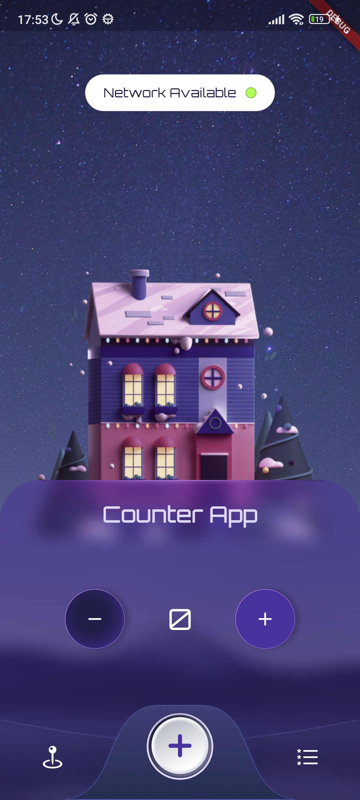 | 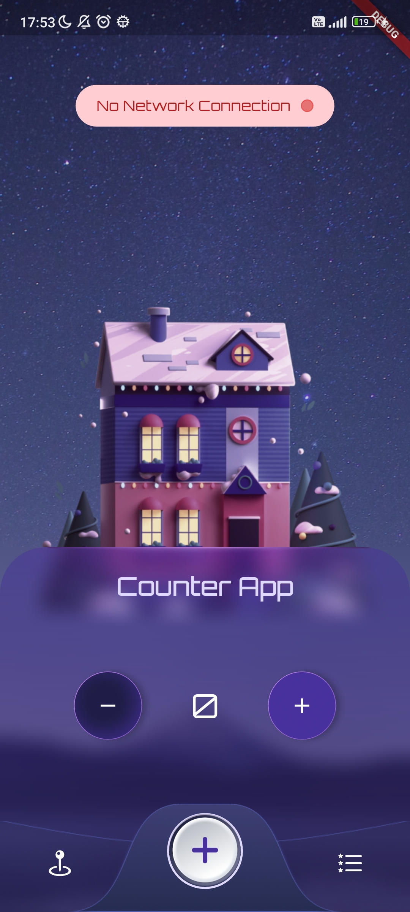   | 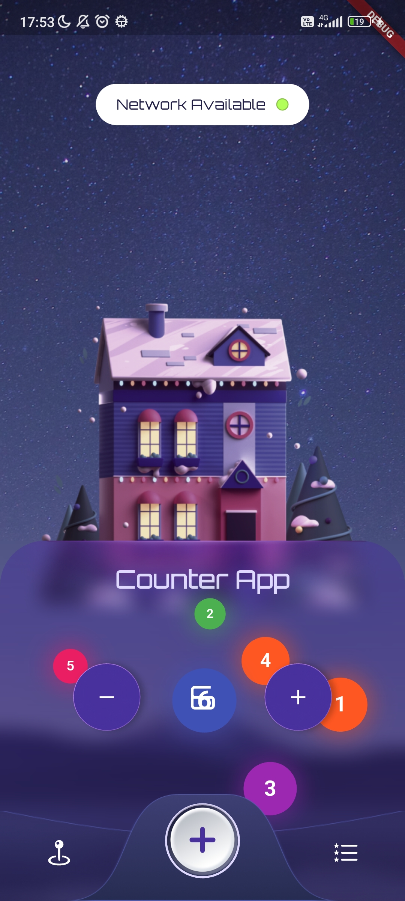   | 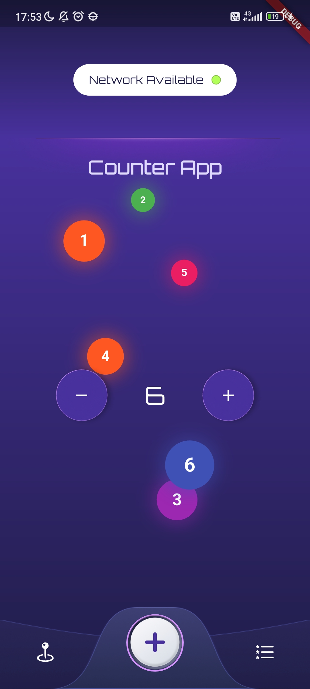   |
| ---------------------------------------- | ------------------------------------------ | ------------------------------------------ | ------------------------------------------ |
| 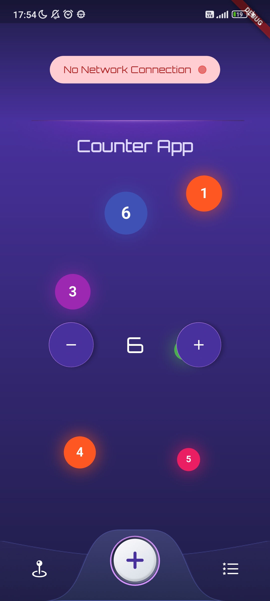 | 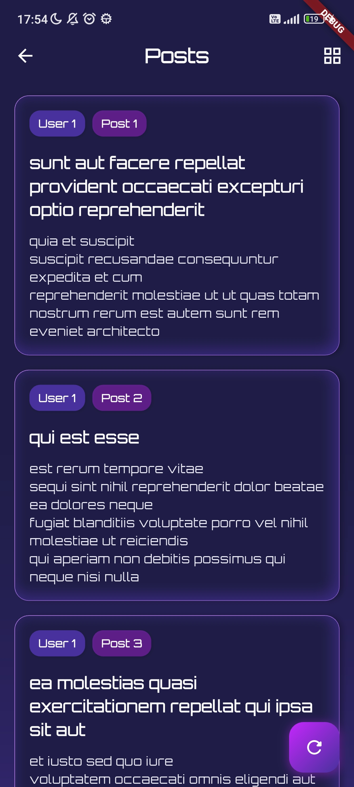   | 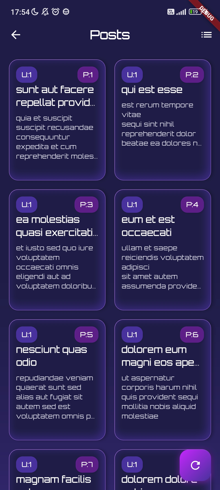   | 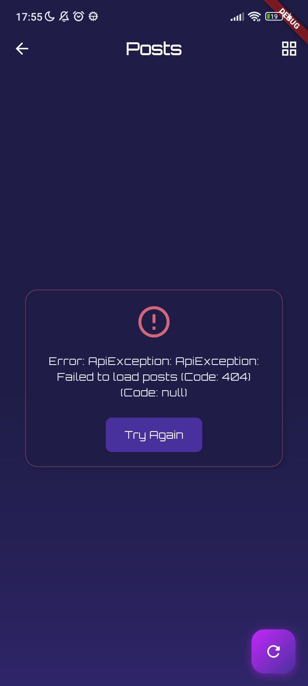   |
|  | 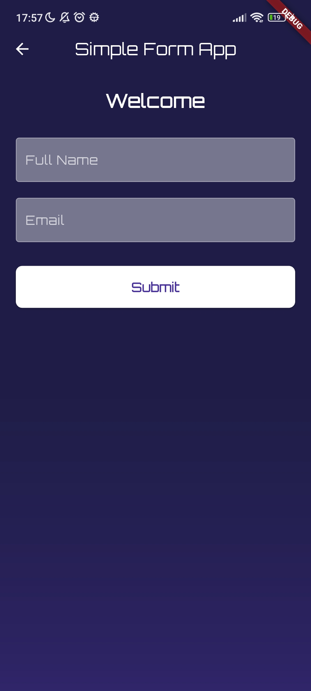 | 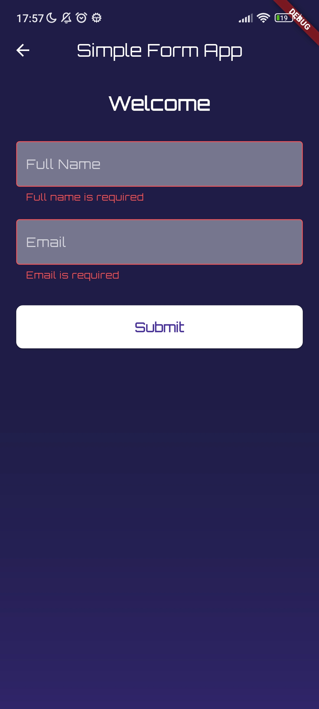 | 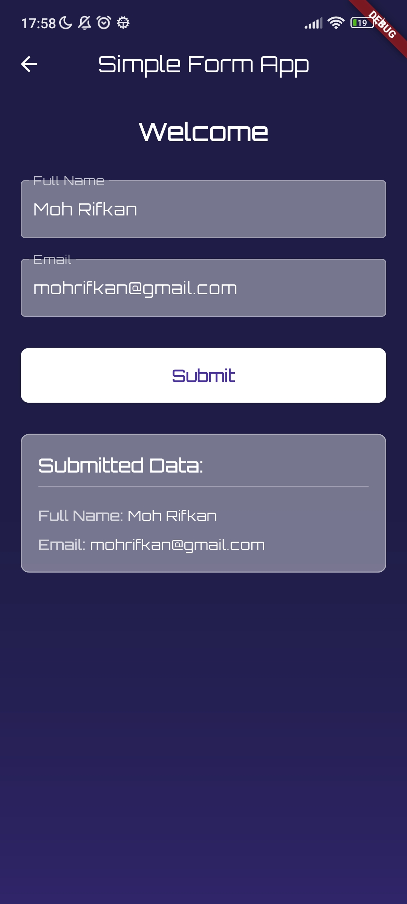 |

## Video Demo

[Download Demo](assets/videos/demo.mp4)

Click the image above to view the app demo video.

## Dependencies Used

| Package              | Version | Purpose                              |
| -------------------- | ------- | ------------------------------------ |
| `connectivity_plus`  | ^6.1.4  | Check internet connection status     |
| `email_validator`    | ^3.0.0  | Email format validation              |
| `equatable`          | ^2.0.7  | Simplify object comparison           |
| `flutter_bloc`       | ^9.1.1  | State management using BLoC pattern  |
| `firebase_core`      | ^3.13.0 | Firebase core for distribution app   |
| `flutter_svg`        | ^2.1.0  | Render SVG image files               |
| `get_it`             | ^8.0.3  | Dependency injection service locator |
| `google_fonts`       | ^6.2.1  | Use Google Fonts in the app          |
| `http`               | ^1.4.0  | Make HTTP requests to APIs           |
| `shared_preferences` | ^2.5.3  | Local storage for caching data       |

## Implementation Details

### Question 1: Fetch and Display API Data

- Implemented using BLoC pattern for state management
- Loading indicators during API calls
- Error handling for failed requests
- Refresh functionality
- Offline caching with SharedPreferences

### Question 2: Input Forms and Validation

- Form validation on submit
- Real-time validation feedback
- Error messages for invalid inputs
- Display of valid submitted data

### Question 3: Counter with State Management

- BLoC pattern implementation
- Minimum value constraint (≥ 0)
- Clean UI with centered counter display

## Design Reference

UI design inspired by:  
[Weather App UI Design on Figma](https://www.figma.com/community/file/1100826294536456295/weather-app-ui-design)

## Download APK

[Download Apk](assets/apk/Physiomobile%20Test%20App.apk)

Click the image above to download the APK file.

## How to Run

1. Clone this repository
2. Run `flutter pub get` to install dependencies
3. Run `flutter run` to launch the app
